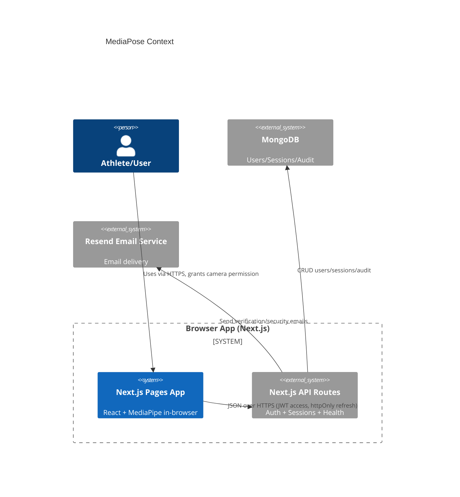
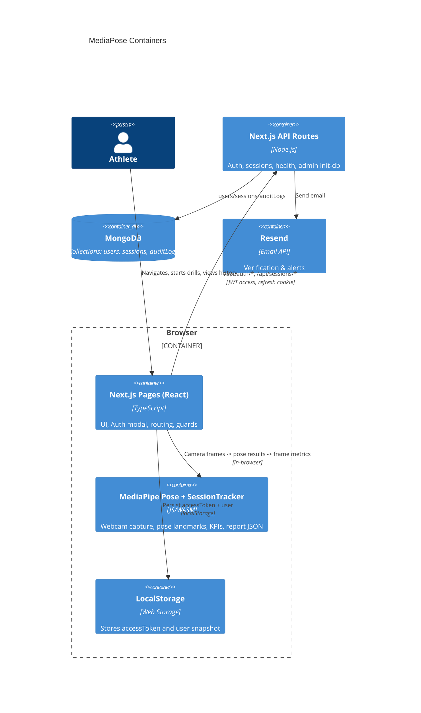
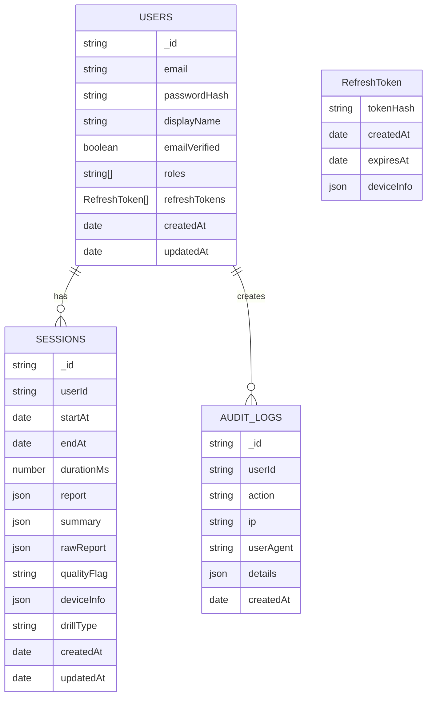

## Update (Sept 2025): Metrics v2 — Aggregated-only storage

This project now implements a v2, event-driven metrics pipeline that stores only the aggregated SessionReport in the database and keeps raw events in memory during a session:

- Client finalize payload: the browser posts finalizedReport as an aggregated object
  - Shape: { schemaVersion: 2, report: SessionReport, summary: SessionReport | MinimalSummary }
  - No raw events are sent to the server; SessionTracker clears raw events in-memory after finalize.
- Server persistence:
  - `sessions.report?: SessionReport` is the v2 canonical record for a session.
  - `sessions.rawReport?: Record<string, any>` is now legacy and only populated when older clients upload v1 payloads.
  - Listing and detail APIs prefer `summary` (if present) and fall back to `report` for display; UI stays backward-compatible.
- API endpoint updates:
  - `POST /api/sessions/[sessionId]` accepts v2 payloads (schemaVersion + report + summary) and stores `report` + `summary`.
  - `GET /api/sessions/[sessionId]` returns `report` alongside legacy `rawReport` for compatibility.
  - `GET /api/sessions` returns `summary` (or `report` fallback) in each item.
  - `GET /api/session-metrics` advertises `METRICS_SCHEMA_VERSION = 2` and returns an example SessionReport shape.
- Code modules introduced for v2:
  - `lib/metrics/constants.ts` — METRICS_SCHEMA_VERSION and score weights
  - `lib/metrics/detectors.ts` — event detector stubs and intensity sampling
  - `lib/metrics/kpi.ts` — KPI calculators derived from RawEvents
  - `lib/metrics/reportFromEvents.ts` — builds SessionReport from RawEvents
  - `lib/metrics/SessionTracker.ts` — now accumulates RawEvents in-memory and generates the report at finalize, then clears events
- UI updates:
  - `components/sessions/SessionHistory.tsx` prefers `report` when rendering, with legacy fallbacks.
  - `pages/drill.tsx` posts the aggregated v2 payload on finalize (uses METRICS_SCHEMA_VERSION).

Notes:
- Previous mentions that “rawReport is the computed JSON metrics persisted” are now legacy. The authoritative v2 persisted artifact is `report` (aggregated), while raw is never stored.

## Executive Summary

MediaPose (aka Roll Metrics) is a Next.js 14 web application that performs in‑browser pose tracking using MediaPipe Pose and records training sessions with computed metrics. The app includes a minimal backend via Next.js API routes for authentication (JWT access + httpOnly refresh cookie), email verification (Resend), and MongoDB persistence of session summaries. Client logic captures webcam video, runs pose inference locally, derives KPIs, and optionally saves session reports to the database. Email‑unverified users can log in but cannot use session endpoints.

What it does today
- Client: Real‑time pose estimation in the browser with MediaPipe Pose; draws landmarks; computes angles, symmetry deltas, detection rate, posture issues, simple rep logic for a few movements; derives a SessionRecord with live KPIs; produces a summarized SessionReport JSON at finalize.
- Auth: Signup/login with bcrypt password hashing and JWT access tokens; refresh token rotation via secure httpOnly cookie; email verification flow via tokenized link and Resend email service.
- Storage: MongoDB collections for users, sessions, and audit logs (indexes ensured). Sessions persist an aggregated `report` (v2 canonical) and a `summary`; `rawReport` is legacy-only for older clients. 90‑day TTL on sessions.
- API: Next.js API routes for auth, health, session list/start/finish, and admin init‑db. Middlewares provide CORS, error handling, auth verification, and rate limiting (in‑memory).
- UI: Landing with modal auth, protected pages for home, drill (pose), account, profile, verify‑email screen; session history table queries server and shows details.

Key constraints
- All CV runs client‑side in browser; no raw video is uploaded or stored by the server. Only aggregated metrics (`report` + `summary`) are persisted; raw event streams never leave the browser.
- Netlify function payloads are limited; finish session endpoint enforces 2MB body limit and Content‑Length guard.
- Rate limiting is in‑memory per serverless instance (non‑distributed); adequate for low traffic but not consistent across instances.
- Email sending requires Resend API key and verified sender/domain.
- Node engine >=18 <21; Next.js 14 with standalone output; hosted on Netlify or Vercel (config present for both), with NEXT_PUBLIC_BASE_URL configured.

[Evidence]
- Client pose pipeline: `pages/drill.tsx` (entire file)
- Metrics types/tracker/report: `lib/metrics/types.ts`, `lib/metrics/SessionTracker.ts`, `lib/metrics/report.ts`
- Auth/API: `pages/api/auth/*.ts`, `lib/server/{auth,verification,email,validation,middleware,rateLimit,db}.ts`
- DB and indexes/TTL: `lib/server/db.ts` (users/sessions/auditLogs; TTL on sessions, auditLogs)
- Netlify/Vercel config: `netlify.toml`, `vercel.json`, `next.config.js`
- Env requirements: `ENVIRONMENT.md`

---

## System Inventory

Frameworks and versions
- Node: engines >=18 <21 [package.json]
- Next.js: ^14.2.5 [package.json]
- React/ReactDOM: ^18.3.1 [package.json]
- TypeScript: ^5.4.5 [package.json]
- TailwindCSS: ^3.4.7; PostCSS/Autoprefixer [package.json]
- MediaPipe: `@mediapipe/pose`, `@mediapipe/camera_utils`, `@mediapipe/drawing_utils` [package.json]
- MongoDB: mongodb ^6.20.0; mongoose present but not used in code paths [package.json, no usages]
- Auth: jsonwebtoken ^9, bcryptjs ^3 [package.json]
- Validation: zod ^4 [package.json]
- State: zustand ^4 [package.json]
- Email: resend ^6 [package.json]

Build tools and scripts
- Scripts: dev/build/start/lint via next [package.json]
- next.config: `output: 'standalone'` [next.config.js]
- TypeScript config: path alias `@/*` [tsconfig.json]

External services/APIs and environment variables
- Resend Email API for verification/security alerts [lib/server/email.ts]
- MongoDB (Atlas or self hosted) via MONGODB_URI [lib/server/db.ts, ENVIRONMENT.md]
- Environment variables: JWT secrets, token TTLs, cookie name/flags, BASE_URL, CORS origins, Resend API key, etc. [ENVIRONMENT.md]
- Browser Web APIs: MediaDevices.getUserMedia, Web Speech API (speechSynthesis) for voice cues [pages/drill.tsx]

[Evidence]
- `package.json`, `next.config.js`, `tsconfig.json`
- `ENVIRONMENT.md`
- `lib/server/email.ts`, `lib/server/db.ts`
- `pages/drill.tsx` (speech synthesis, getUserMedia)

---

## C4 Diagrams

### Context diagram


### Container diagram


### Component diagram (pose pipeline)
```mermaid
flowchart LR
  A[Camera (getUserMedia)] --> B[MediaPipe Pose]
  B --> C[Landmarks + Visibility]
  C --> D[Feature Extraction (angles, symmetry, bbox, fps)]
  D --> E[SessionTracker.updateFrame]
  E --> F[KPIs (controlTime, attempts, intensity, reaction)]
  E --> G[Segments & Running Stats]
  E --> H[Live UI + Voice Cues]
  H -. finalize .-> I[SessionTracker.finalize]
  I --> J[SessionReport JSON]
  J --> K[/api/sessions/:id POST]
  K --> L[(MongoDB sessions)]
```

[Evidence]
- `pages/drill.tsx` (A-H)
- `lib/metrics/SessionTracker.ts` (E, G, I)
- `lib/metrics/report.ts` (J)
- `pages/api/sessions/[sessionId]/index.ts` (K)

---

## Route & Module Map

Next.js pages
- `/` Landing with modal login/signup [pages/index.tsx]
- `/home` Protected dashboard, start drill, history [pages/home.tsx]
- `/drill` Protected pose session page [pages/drill.tsx]
- `/account` Protected account overview + session history [pages/account.tsx]
- `/profile` Protected legacy profile view (client metrics) [pages/profile.tsx]
- `/verify-email` Email verification UX [pages/verify-email.tsx]

API routes
- `GET /api/health` status + db ping [pages/api/health.ts]
- Auth
  - `POST /api/auth/signup` [pages/api/auth/signup.ts]
  - `POST /api/auth/login` [pages/api/auth/login.ts]
  - `POST /api/auth/refresh` [pages/api/auth/refresh.ts]
  - `POST /api/auth/logout` [pages/api/auth/logout.ts]
  - `GET /api/auth/verify-email?token=...` [pages/api/auth/verify-email.ts]
  - `POST /api/auth/resend-verification` [pages/api/auth/resend-verification.ts]
- Sessions
  - `GET /api/sessions` list with pagination and hideLowQuality [pages/api/sessions/index.ts]
  - `POST /api/sessions/start` create stub [pages/api/sessions/start.ts]
  - `GET|POST /api/sessions/[sessionId]` get details or finish session [pages/api/sessions/[sessionId]/index.ts]
- Admin
  - `POST /api/admin/init-db` ensure indexes (admin only) [pages/api/admin/init-db.ts]

Middleware/guards
- CORS + Error: `withCorsAndError`, `withError`, `withCors` [lib/server/middleware.ts]
- Auth: `withAuth`, `withVerifiedUser`, `withAuthAndCors`, `withAuthVerifiedAndCors` [lib/server/middleware.ts]
- Methods: `withMethods` [lib/server/middleware.ts]
- Rate limit: `withAuthRateLimit`, `withEmailRateLimit` (in‑memory) [lib/server/rateLimit.ts]

Navigation flows and guarded routes
- `RequireAuth` redirects unauthenticated users to `/` [components/RequireAuth.tsx]
- Verified email required for session endpoints via server middleware; UI blocks only when requireVerified true [components/RequireAuth.tsx, withVerifiedUser]

State management
- Auth state: zustand `components/useAuth.ts` stores user + accessToken in localStorage; uses `/api/auth/refresh` with httpOnly cookie for refresh.
- Pose/session state: zustand `components/usePoseStore.ts` maintains live metrics, `SessionTracker`, session history (client-side list), and provides `getLiveKPIs`.
- API client: `lib/apiClient.ts` wraps fetch, handles token refresh, surfaces sessions and auth calls.

Data flow (camera → analysis → feedback → storage)
- Camera frames in `/drill` → MediaPipe Pose → compute angles/symmetry/detection → `SessionTracker.updateFrame` → live KPIs → UI overlays and optional speech synthesis; on finalize, build `SessionReport` and POST to `/api/sessions/:id` → MongoDB.

[Evidence]
- Pages and API files listed above; `components/RequireAuth.tsx`; `components/useAuth.ts`; `components/usePoseStore.ts`; `lib/apiClient.ts`

---

## Data & Schema

Where data is stored
- Users, Sessions, AuditLogs: MongoDB [lib/server/db.ts]
- Client persistence: localStorage for `accessToken` and a serialized `auth-user` [lib/apiClient.ts, components/useAuth.ts]
- No raw video stored; only aggregated metrics JSON (`report` + `summary`) persisted; legacy `rawReport` may exist only for v1 uploads.

Collections (TypeScript interfaces)
- User
  - email, passwordHash, displayName, emailVerified, roles[], refreshTokens[{tokenHash, createdAt, expiresAt, deviceInfo}], createdAt, updatedAt
- Session
  - userId, startAt, endAt?, durationMs?, report?: Record, summary?: Record, rawReport?: Record, qualityFlag?: 'good'|'low'|'discard', deviceInfo?, mediaType?, drillType?, createdAt, updatedAt
- AuditLog
  - userId?, action, ip?, userAgent?, details?, createdAt

Indexes
- users: email unique; refreshTokens.expiresAt
- sessions: userId+createdAt desc; TTL on createdAt (90 days)
- auditLogs: userId+createdAt; TTL 365 days

ERD


PII handling and retention
- PII stored: user email, displayName, roles; no video frames. Refresh tokens stored as SHA‑256 hashes. [lib/server/auth.ts]
- Sessions TTL 90 days; audit logs TTL 365 days via TTL indexes. [lib/server/db.ts]
- Raw video never stored (inferred from code paths: only browser canvas and MediaPipe, no upload code). [pages/drill.tsx]

[Evidence]
- `lib/server/db.ts` (interfaces, ensureIndexes)
- `lib/server/auth.ts` (refresh token hashing)
- `pages/drill.tsx` (no upload of frames)

---

## API Surface

List of endpoints (methods)
- Auth: POST /api/auth/signup, POST /api/auth/login, POST /api/auth/refresh, POST /api/auth/logout, GET /api/auth/verify-email, POST /api/auth/resend-verification
- Sessions: GET /api/sessions, POST /api/sessions/start, GET|POST /api/sessions/{sessionId}
- Health: GET /api/health
- Admin: POST /api/admin/init-db
- Metrics: GET /api/session-metrics (example/stub)

Authentication & authorization
- Access token: JWT in Authorization: Bearer, signed with JWT_SECRET; expires per ACCESS_TOKEN_TTL.
- Refresh token: random 32B, stored as SHA‑256 hash in DB; delivered as httpOnly cookie `COOKIE_NAME_REFRESH`, rotated on use; signed JWT not used for refresh.
- Email verification: JWT token signed with JWT_REFRESH_SECRET, type=email_verification; 24h default.
- Role enforcement: admin required for init‑db; email verification required for session endpoints.

OpenAPI 3.0 (derived from handlers/schemas)
```yaml
openapi: 3.0.3
info:
  title: MediaPose API
  version: "1.0.0"
servers:
  - url: /
components:
  securitySchemes:
    bearerAuth:
      type: http
      scheme: bearer
      bearerFormat: JWT
  schemas:
    ApiError:
      type: object
      required: [code, message]
      properties:
        code: { type: string }
        message: { type: string }
    ApiResponseSuccess:
      type: object
      properties:
        success: { type: boolean, enum: [true] }
        data: { }
    ApiResponseError:
      type: object
      properties:
        success: { type: boolean, enum: [false] }
        error: { $ref: '#/components/schemas/ApiError' }
    LoginRequest:
      type: object
      required: [email, password]
      properties:
        email: { type: string, format: email }
        password: { type: string, minLength: 1 }
    LoginResponse:
      type: object
      required: [accessToken, user]
      properties:
        accessToken: { type: string }
        user:
          type: object
          required: [id, email, displayName, emailVerified, roles]
          properties:
            id: { type: string }
            email: { type: string }
            displayName: { type: string }
            emailVerified: { type: boolean }
            roles:
              type: array
              items: { type: string }
    SignupRequest:
      type: object
      required: [email, password, displayName]
      properties:
        email: { type: string, format: email }
        password: { type: string, minLength: 8 }
        displayName: { type: string, minLength: 1, maxLength: 100 }
    SessionCreateRequest:
      type: object
      properties:
        drillType: { type: string }
        deviceInfo: { type: object, additionalProperties: true }
        metadata: { type: object, additionalProperties: true }
        startAt: { type: string, format: date-time }
    SessionCreateResponse:
      type: object
      required: [sessionId]
      properties:
        sessionId: { type: string }
    FinishSessionRequest:
      type: object
      required: [endAt]
      properties:
        finalizedReport:
          description: Aggregated metrics wrapper (v2: { schemaVersion: 2, report, summary }) or legacy v1 raw payload
          type: object
          additionalProperties: true
        endAt: { type: string, format: date-time }
    SessionSummary:
      type: object
      required: [id, startAt]
      properties:
        id: { type: string }
        startAt: { type: string, format: date-time }
        endAt: { type: string, format: date-time, nullable: true }
        durationMs: { type: integer, nullable: true }
        qualityFlag: { type: string, enum: [good, low, discard], nullable: true }
        summary: { type: object, additionalProperties: true, nullable: true }
        reps: { type: integer, nullable: true }
        detectionRate: { type: number, nullable: true }
    SessionListResponse:
      type: object
      required: [sessions, pagination]
      properties:
        sessions:
          type: array
          items: { $ref: '#/components/schemas/SessionSummary' }
        pagination:
          type: object
          required: [page, limit, total, pages]
          properties:
            page: { type: integer }
            limit: { type: integer }
            total: { type: integer }
            pages: { type: integer }
paths:
  /api/auth/signup:
    post:
      requestBody:
        required: true
        content:
          application/json:
            schema: { $ref: '#/components/schemas/SignupRequest' }
      responses:
        '201': { description: Created, content: { application/json: { schema: { $ref: '#/components/schemas/ApiResponseSuccess' } } } }
        '400': { description: Validation error }
        '409': { description: Email exists }
  /api/auth/login:
    post:
      requestBody:
        required: true
        content:
          application/json:
            schema: { $ref: '#/components/schemas/LoginRequest' }
      responses:
        '200': { description: OK, content: { application/json: { schema: { $ref: '#/components/schemas/LoginResponse' } } } }
        '401': { description: Invalid credentials }
  /api/auth/refresh:
    post:
      responses:
        '200': { description: OK }
        '401': { description: Invalid/expired refresh }
  /api/auth/logout:
    post:
      security: [ { bearerAuth: [] } ]
      responses:
        '200': { description: OK }
  /api/auth/verify-email:
    get:
      parameters:
        - in: query
          name: token
          required: true
          schema: { type: string }
      responses:
        '200': { description: Verified }
        '400': { description: Invalid token }
  /api/auth/resend-verification:
    post:
      requestBody:
        required: true
        content:
          application/json:
            schema:
              type: object
              properties:
                email: { type: string, format: email }
      responses:
        '200': { description: OK }
  /api/sessions:
    get:
      security: [ { bearerAuth: [] } ]
      parameters:
        - in: query
          name: page
          schema: { type: integer, default: 1 }
        - in: query
          name: limit
          schema: { type: integer, default: 20 }
        - in: query
          name: hideLowQuality
          schema: { type: boolean }
      responses:
        '200': { description: OK, content: { application/json: { schema: { $ref: '#/components/schemas/SessionListResponse' } } } }
        '401': { description: Unauthorized }
  /api/sessions/start:
    post:
      security: [ { bearerAuth: [] } ]
      requestBody:
        required: true
        content:
          application/json:
            schema: { $ref: '#/components/schemas/SessionCreateRequest' }
      responses:
        '201': { description: Created, content: { application/json: { schema: { $ref: '#/components/schemas/SessionCreateResponse' } } } }
        '403': { description: Email not verified }
  /api/sessions/{sessionId}:
    get:
      security: [ { bearerAuth: [] } ]
      parameters:
        - in: path
          name: sessionId
          required: true
          schema: { type: string }
      responses:
        '200': { description: OK }
        '404': { description: Not found }
    post:
      security: [ { bearerAuth: [] } ]
      parameters:
        - in: path
          name: sessionId
          required: true
          schema: { type: string }
      requestBody:
        required: true
        content:
          application/json:
            schema: { $ref: '#/components/schemas/FinishSessionRequest' }
      responses:
        '200': { description: Finished }
        '409': { description: Already finished }
  /api/health:
    get:
      responses:
        '200': { description: OK }
  /api/session-metrics:
    get:
      responses:
        '200': { description: Example metrics schema }
  /api/admin/init-db:
    post:
      security: [ { bearerAuth: [] } ]
      responses:
        '200': { description: OK }
        '403': { description: Admin only }
```

[Evidence]
- Endpoints listed in pages/api/* files; request/response shapes derive from `lib/server/validation.ts` and handler code.

---

## Security & Privacy

Controls and mitigations
- Password hashing with bcryptjs (salt rounds 10). [lib/server/auth.ts]
- JWT access token verification with error mapping; refresh token rotation and reuse detection; cookies are httpOnly and Secure unless SECURE_COOKIES=false. [lib/server/auth.ts]
- CORS configurable via CORS_ALLOWED_ORIGINS; preflight handled. [lib/server/middleware.ts]
- Email verification required to access session endpoints (`withVerifiedUser`). [lib/server/middleware.ts]
- Rate limiting for auth/email endpoints (in‑memory). [lib/server/rateLimit.ts]
- No raw media upload code; processing is local; only computed metrics JSON stored. [pages/drill.tsx]

Potential gaps
- CSRF: Refresh endpoint uses cookie and no CSRF token; mitigated partially by SameSite=Strict, but cross‑site POST risks should be assessed if CORS allows external origins. [lib/server/auth.ts, middleware.ts]
- Rate limiting not distributed; multiple instances can bypass per‑instance limits. [lib/server/rateLimit.ts]
- CSP headers not configured at framework level. [no explicit CSP seen]

[Evidence]
- Files referenced above.

---

## Performance

Observed design
- Pose inference on client using MediaPipe; FPS estimate via dt; some lightweight drawing on canvas. [pages/drill.tsx]
- Model complexity adjustable (0/1/2); thresholds vary by skill mode. [pages/drill.tsx]
- Inference pipeline avoids extra allocations; segments are rolled every 30s; EMA for intensity. [lib/metrics/SessionTracker.ts]
- Code splitting: MediaPipe libs are dynamically imported. [pages/drill.tsx]

Likely bottlenecks
- MediaPipe model inference and canvas rendering on low‑power devices.
- Speech synthesis is lightweight relative to inference.
- Session finalize JSON size approaching 2MB limit could be heavy.

Acceleration features
- WebGL is leveraged internally by MediaPipe Pose; no workers used here.
- Dynamic import for pose/camera/drawing libs.

[Evidence]
- `pages/drill.tsx` (dynamic import, FPS)
- `lib/metrics/SessionTracker.ts` (EMA intensity, segment handling)

---

## Deployment & Ops

Hosting targets
- Netlify: `netlify.toml` with @netlify/plugin-nextjs; publish .next; env has NEXT_PUBLIC_BASE_URL set to Netlify URL. [netlify.toml]
- Vercel: minimal config in `vercel.json` (cleanUrls, trailingSlash). [vercel.json]
- Next standalone output enabled. [next.config.js]

Runtime and secrets
- Node >=18 <21 enforced; env variables in ENVIRONMENT.md. [package.json, ENVIRONMENT.md]
- `scripts/init-db.ts` can run ensureIndexes; also exposed via `/api/admin/init-db`.

Logging/analytics
- Server logs via console.log in handlers; no external telemetry found.

CI/CD
- Not defined in repo; rely on platform defaults.

[Evidence]
- Config files as referenced; `ENVIRONMENT.md`; `scripts/init-db.ts`.

---

## Gaps & Risks

Unknowns + Assumptions
- Unknown deployment platform in production; repository includes both Netlify and Vercel configs.
- CSP/CORS policies depend on environment variables; not present by default in repo.
- Mongoose is listed but unused; assuming MongoDB driver is the implementation of record.

Issues found
- In‑memory rate limiting not distributed; may allow bursts across instances.
- No CSRF token for refresh/logout; relies on SameSite=Strict and CORS to limit risk.
- Email token is signed with refresh secret; acceptable, but mixing concerns—tracked via type field.
- No formal logging/metrics; health endpoint checks DB only.
- Some metric files are empty (`lib/metrics/kpi.ts`, `lib/metrics/sessionAnalytics.ts`).

Quick wins
- Add CSP headers and stricter CORS in production.
- Implement Redis‑backed rate limiting (doc already present in comments).
- Add CSRF protection (double‑submit or origin checks) for cookie‑auth endpoints.
- Remove unused dependency (mongoose) or adopt it consistently.

[Evidence]
- Files: `lib/server/rateLimit.ts` (Redis upgrade notes), `ENVIRONMENT.md`, package.json

---

## Improvements

The following are proposals, not claims about current behavior:

1) Distributed rate limiting via Redis
- Rationale: Ensure consistent limits across serverless instances and regions.
- Effort: Medium. Replace in‑memory Map with Redis ops; env for REDIS_URL; adopt existing guidance in `rateLimit.ts` comments.
- Trade‑offs: Adds external dependency and latency; improves reliability under load.

2) CSRF hardening for refresh/logout
- Rationale: Refresh uses cookie; add CSRF token or strict Origin/Referer validation for same‑site requests.
- Effort: Low‑Medium. Add header check middleware or double‑submit cookie pattern.
- Trade‑offs: Slight client complexity; improved protection.

3) Content Security Policy (CSP)
- Rationale: Reduce XSS risk; lock down script/img/connect sources; allow MediaPipe CDN.
- Effort: Low. Add Next.js headers() in custom config or middleware to set CSP.
- Trade‑offs: Must maintain allowlist for CDNs and APIs.

4) Telemetry and structured logging
- Rationale: Capture error rates, performance metrics, and audit trails beyond Mongo TTL logs.
- Effort: Medium. Integrate a logging library (pino/winston) and optional APM.
- Trade‑offs: Operational overhead; better observability.

5) Session payload size controls
- Rationale: Enforce/prune rawReport fields or compress before upload to keep <2MB.
- Effort: Low. Filter nonessential arrays; optional gzip in client + server accept.
- Trade‑offs: Minor dev work; safer against function limits.

6) Remove or integrate Mongoose
- Rationale: Avoid dependency drift; currently unused.
- Effort: Low. Remove from package.json or adopt consistent schemas with Mongoose models.
- Trade‑offs: None; cleanup.

7) Strict CORS configuration
- Rationale: Avoid wildcard in production; use explicit allowed origins.
- Effort: Low. Set CORS_ALLOWED_ORIGINS in env.
- Trade‑offs: Operational coordination.

8) Optional workers for rendering/inference offload
- Rationale: Improve UI responsiveness on low‑end devices.
- Effort: Medium‑High. Introduce Web Workers or OffscreenCanvas; depends on MediaPipe support.
- Trade‑offs: Complexity; performance gains.

---

## [Evidence]

Direct code references have been embedded per section. Key files:
- Routes: `pages/api/**/*`, `pages/*.tsx`
- Middleware: `lib/server/middleware.ts`, `lib/server/rateLimit.ts`
- Auth: `lib/server/auth.ts`, `lib/server/verification.ts`
- Email: `lib/server/email.ts`
- DB: `lib/server/db.ts`, `scripts/init-db.ts`
- Pose/KPIs: `pages/drill.tsx`, `lib/metrics/*`
- Client state/api: `components/useAuth.ts`, `components/usePoseStore.ts`, `lib/apiClient.ts`
- Deploy: `netlify.toml`, `vercel.json`, `next.config.js`
- Env: `ENVIRONMENT.md`

---

## Open Questions

1) Which hosting target is authoritative (Netlify vs Vercel) for production? Align BASE_URL and CORS accordingly.
2) Should CSRF protection be added to refresh/logout beyond SameSite cookies? If yes, preferred pattern?
3) Is Redis available for distributed rate limiting? If not, acceptable risk level for in‑memory approach?
4) Any compliance requirements for data retention beyond 90‑day TTL on sessions? Adjust TTLs if needed.
5) Should we persist additional telemetry (e.g., failures in pose pipeline) for debugging?
6) Can we remove mongoose from dependencies, or is there future intent to migrate to it?
